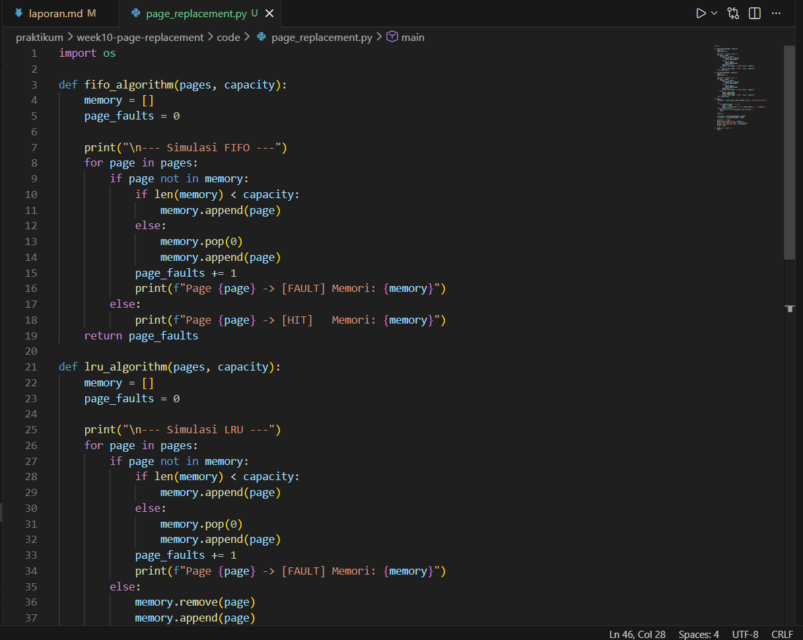
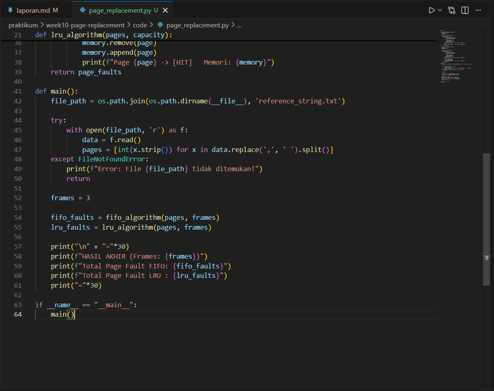
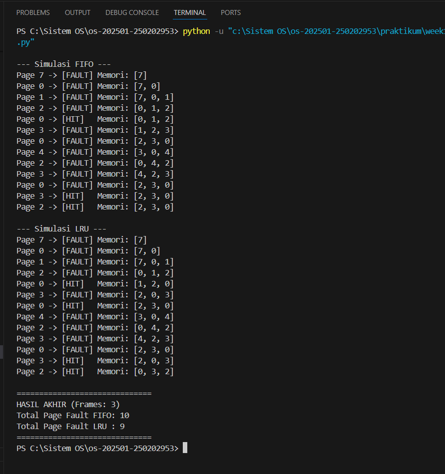

# Laporan Praktikum Minggu [10]
## Topik: Manajemen Memori – Page Replacement (FIFO & LRU)

---

## Identitas
- **Nama**  : Muhamad Juhan 
- **NIM**   : 250202953
- **Kelas** : 1 IKRB

---

## Tujuan
- Implementasi Algoritma FIFO: Mahasiswa mampu mengimplementasikan logika algoritma First-In First-Out ke dalam bahasa pemrograman untuk mensimulasikan pergantian halaman memori.

- Implementasi Algoritma LRU: Mahasiswa mampu mengimplementasikan logika algoritma Least Recently Used dan memahami cara kerja pemindahan halaman berdasarkan riwayat penggunaan.

- Simulasi Memori Virtual: Mahasiswa mampu menjalankan simulasi manajemen memori menggunakan dataset (reference string) dan jumlah frame tertentu secara akurat.

- Analisis Performa: Mahasiswa mampu membandingkan efisiensi antara algoritma FIFO dan LRU dengan menghitung dan menganalisis jumlah page fault yang terjadi.
---

## Dasar Teori
- Memori Virtual & Paging: Sistem operasi menggunakan memori virtual untuk menjalankan program yang lebih besar dari kapasitas fisik RAM dengan cara membagi memori menjadi unit-unit kecil yang disebut page.

- Page Fault: Kondisi ini terjadi ketika CPU mencoba mengakses halaman (page) yang belum dimuat ke dalam memori fisik (RAM), sehingga sistem harus mengambil halaman tersebut dari penyimpanan sekunder.

- Algoritma Page Replacement: Mekanisme yang menentukan halaman mana yang harus dikeluarkan dari memori utama ketika semua frame sudah penuh dan ada halaman baru yang perlu masuk.

- Algoritma FIFO (First-In First-Out): Algoritma paling sederhana yang mengganti halaman berdasarkan waktu kedatangannya; halaman yang paling lama berada di memori akan menjadi yang pertama diganti.

- Algoritma LRU (Least Recently Used): Algoritma yang lebih efisien dengan prinsip mengganti halaman yang paling lama tidak diakses oleh sistem, dengan asumsi halaman yang baru saja digunakan akan digunakan kembali dalam waktu dekat.

---

## Langkah Praktikum
1. Menyiapkan folder code, screenshots, dan file laporan.
2. Membuat dataset pada file reference_string.txt.
3. Menulis kode simulasi FIFO dan LRU di page_replacement.py.
4. Menjalankan perintah python page_replacement.py di terminal.
5. Mengambil screenshot hasil eksekusi program.
6. Bikin laporan lalu push ke github

---

## Kode / Perintah
Tuliskan potongan kode atau perintah utama:
```bash
python page_replacement.py
```

---

## Hasil Eksekusi
Sertakan screenshot hasil percobaan atau diagram:









---

## Analisis

- Berdasarkan simulasi dengan reference string yang diberikan, algoritma FIFO menghasilkan total 10 Page Fault.

- Algoritma LRU memberikan hasil yang lebih optimal dengan total 9 Page Fault.

- Perbedaan satu poin ini menunjukkan bahwa LRU lebih cerdas dalam mendeteksi halaman yang masih sering digunakan (seperti pada saat akses Page 0 dan 3), sehingga tidak menghapusnya dari memori terlalu cepat dibandingkan FIFO.

- Dengan kapasitas 3 frame, kedua algoritma menunjukkan performa yang cukup kompetitif, namun LRU tetap menjadi pilihan yang lebih baik untuk meminimalisir kesalahan akses memori pada dataset ini.


 | Algoritma | Jumlah Page Fault | Keterangan |
   |:--|:--:|:--|
   | FIFO | 10 | Mengganti halaman yang pertama kali masuk ke memori tanpa melihat frekuensi akses. |
   | LRU | 9 | Mengganti halaman yang sudah paling lama tidak digunakan/diakses oleh sistem. |

- Mengapa jumlah Page Fault bisa berbeda?

   Jumlah page fault berbeda karena setiap algoritma memiliki logika pemilihan korban (halaman yang akan dihapus dari memori) yang berbeda saat memori penuh:

   1. FIFO hanya melihat urutan waktu masuk. Ia tidak peduli apakah halaman tersebut sering digunakan atau tidak. Hal ini terkadang menyebabkan Belady's Anomaly, di mana menambah kapasitas memori justru bisa meningkatkan jumlah page fault.

   2. LRU lebih "cerdas" karena melihat sejarah penggunaan. LRU berasumsi bahwa halaman yang baru saja digunakan kemungkinan besar akan digunakan lagi dalam waktu dekat. Oleh karena itu, ia hanya menghapus halaman yang sudah benar-benar "nganggur" paling lama.

- Algoritma Mana yang Lebih Efisien?

   Secara umum, LRU lebih efisien daripada FIFO dalam sebagian besar kasus nyata.
   Alasannya:

 1. Optimalitas: LRU mendekati algoritma optimal karena memanfaatkan prinsip Locality of Reference (kecenderungan program untuk mengakses data yang berdekatan dalam waktu yang berdekatan).

   2. Minimasi Page Fault: Pada beban kerja yang berulang, LRU biasanya menghasilkan jumlah page fault yang lebih sedikit dibandingkan FIFO karena ia mempertahankan halaman-halaman yang sedang aktif digunakan.

   3. Stabilitas: Tidak seperti FIFO, LRU tidak menderita Belady’s Anomaly, sehingga penambahan jumlah frame memori akan selalu membantu mengurangi page fault secara konsisten.

   
---

## Kesimpulan

1. Algoritma LRU terbukti lebih efisien dibandingkan FIFO pada dataset ini dengan jumlah page fault yang lebih rendah, yaitu 9 berbanding 10.

2. Efisiensi LRU dipengaruhi oleh kemampuannya memanfaatkan riwayat penggunaan halaman, sehingga halaman yang sering diakses tetap bertahan di memori.

3. Jumlah page fault pada kedua algoritma sangat bergantung pada kapasitas frame yang tersedia dan pola kemunculan angka dalam reference string.
---

## Quiz

1. Apa perbedaan utama FIFO dan LRU?

   - FIFO (First-In First-Out): Mengganti halaman berdasarkan urutan waktu masuk ke memori; halaman yang paling lama berada di dalam frame akan menjadi yang pertama diganti.

   - LRU (Least Recently Used): Mengganti halaman berdasarkan riwayat penggunaan; halaman yang sudah paling lama tidak diakses atau digunakan oleh sistem akan diganti terlebih dahulu.

2. Mengapa FIFO dapat menghasilkan Belady’s Anomaly?

   - FIFO dapat mengalami Belady's Anomaly karena algoritma ini hanya mempertimbangkan urutan waktu masuk dan mengabaikan seberapa sering atau kapan suatu halaman terakhir kali digunakan.

   - Hal ini menyebabkan kondisi paradoks di mana penambahan jumlah frame memori terkadang justru meningkatkan jumlah page fault karena pola antrean yang tidak fleksibel terhadap kebutuhan akses data.

3. Mengapa LRU umumnya menghasilkan performa lebih baik dibanding FIFO?

   - LRU lebih efisien karena bekerja berdasarkan prinsip lokalitas temporal, yaitu asumsi bahwa halaman yang baru saja digunakan kemungkinan besar akan digunakan kembali dalam waktu dekat.

   - Dengan mempertahankan halaman yang aktif digunakan dan hanya membuang halaman yang sudah lama "menganggur", LRU berhasil meminimalisir page fault, seperti yang terlihat pada hasil simulasimu di mana LRU hanya menghasilkan 9 fault sementara FIFO menghasilkan 10 fault.

---

## Refleksi Diri
Tuliskan secara singkat:
- Apa bagian yang paling menantang minggu ini?  
- Bagaimana cara Anda mengatasinya?  

---

**Credit:**  
_Template laporan praktikum Sistem Operasi (SO-202501) – Universitas Putra Bangsa_
