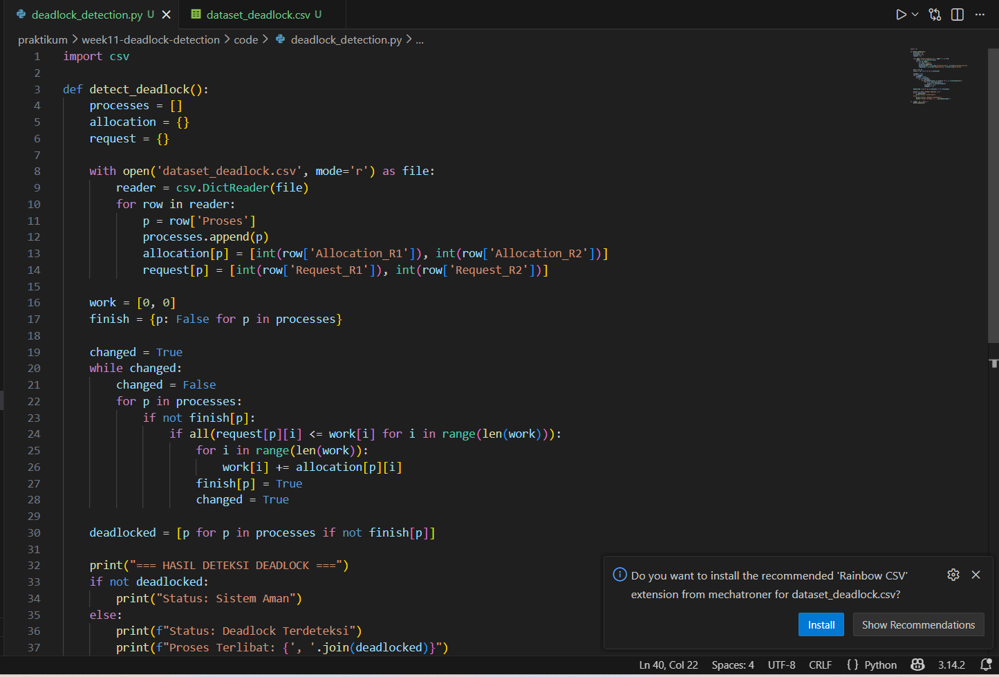
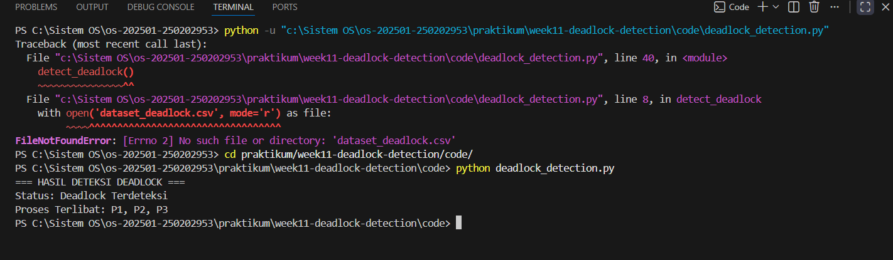

# Laporan Praktikum Minggu [11]
## Topik: Simulasi dan Deteksi Deadlock


---

## Identitas
- **Nama**  : Muhamad Juhan
- **NIM**   : 250202953
- **Kelas** : 1 IKRB

---

## Tujuan

- Mengimplementasikan algoritma deteksi deadlock sederhana menggunakan bahasa pemrograman Python.
- Melakukan simulasi kondisi sistem dengan membaca dataset dari file eksternal berformat CSV.
- Menganalisis keterkaitan antar proses (P1, P2, dan P3) dalam memperebutkan sumber daya sistem (resources).
- Mendeteksi adanya kondisi Circular Wait yang menyebabkan sistem berhenti bekerja (deadlock).

---

## Dasar Teori

1. Deteksi Deadlock: Berbeda dengan pencegahan, metode deteksi membiarkan sistem berjalan dan secara berkala memeriksa apakah ada proses yang saling menunggu dalam siklus yang tidak bisa diputuskan.

2. Kondisi Circular Wait: Ini adalah kunci dari hasil praktikummu, di mana P1 menunggu P2, P2 menunggu P1, dan P3 ikut terjebak karena tidak ada sumber daya yang tersisa untuk memutus rantai penantian tersebut.

3. Resource Allocation State: Status sistem ditentukan oleh perbandingan antara sumber daya yang sudah dipegang (Allocation) dengan sumber daya yang diminta (Request). Jika permintaan tidak bisa dipenuhi oleh sisa sumber daya yang ada (Available), maka sistem masuk ke kondisi unsafe atau deadlock.

---

## Langkah Praktikum

1. Mengisi dataset_deadlock.csv dengan data P1, P2, dan P3 yang dirancang untuk menciptakan kondisi saling menunggu (Circular Wait).

2. Menjalankan kodingan deadlock_detection.py melalui terminal untuk memproses data alokasi dan permintaan resource.

3. Memastikan output terminal menunjukkan "Deadlock Terdeteksi", mengambil screenshot kodingan python dan output di terminal dan memasukan ke folder screenshot

4. Membuat laporan dan diunggah ke github
---

## Kode / Perintah
Tuliskan potongan kode atau perintah utama:
```bash
Python deadlock_detection.py
```

---

## Hasil Eksekusi







---

## Analisis

| Proses | Allocation | Request | Status |
| :--- | :---: | :---: | :--- |
| **P1** | 1, 0 | 0, 1 | **Deadlock** |
| **P2** | 0, 1 | 1, 0 | **Deadlock** |
| **P3** | 0, 0 | 1, 1 | **Deadlock** |

- P1 (Proses 1): Saat ini mengalokasikan (memegang) R1, namun mengajukan permintaan (request) untuk R2. Statusnya Deadlock karena R2 sedang dikunci oleh P2.

- P2 (Proses 2): Saat ini mengalokasikan (memegang) R2, namun mengajukan permintaan (request) untuk R1. Statusnya Deadlock karena R1 sedang dikunci oleh P1.

- P3 (Proses 3): Tidak memegang resource apa pun, namun meminta R1 dan R2. Statusnya Deadlock karena kedua resource tersebut terjebak di dalam siklus P1 dan P2 yang tidak pernah berakhir.
---

## Kesimpulan

- Praktikum ini berhasil mengimplementasikan algoritma deteksi deadlock yang mampu mengidentifikasi kondisi unsafe state pada sistem ketika tidak ada urutan eksekusi (safe sequence) yang tersedia.

- Berdasarkan hasil analisis, ditemukan bahwa proses P1, P2, dan P3 mengalami deadlock akibat kondisi saling menunggu sumber daya (circular wait), di mana sumber daya yang dibutuhkan suatu proses sedang dikunci oleh proses lainnya.

- Percobaan ini membuktikan bahwa tanpa adanya mekanisme pelepasan sumber daya atau pencegahan yang tepat, konflik antara dua proses saja sudah cukup untuk menghentikan seluruh operasional proses lainnya dalam sistem.
---

## Quiz
1. Perbedaan Prevention, Avoidance, dan Detection?

Ketiganya adalah strategi menangani deadlock, namun cara kerjanya berbeda:

- Deadlock Prevention (Pencegahan): Memastikan salah satu dari 4 syarat deadlock (Coffman) tidak pernah terpenuhi. Caranya sangat ketat, misalnya memaksa proses melepas semua resource sebelum meminta yang baru.

- Deadlock Avoidance (Penghindaran): Sistem lebih fleksibel, namun setiap ada permintaan resource, sistem akan menghitung secara real-time apakah pemberian tersebut akan membuat sistem masuk ke "Unsafe State". Contohnya: Algoritma Banker.

- Deadlock Detection (Deteksi): Membiarkan sistem berjalan apa adanya tanpa aturan ketat di awal. Namun, sistem secara berkala menjalankan algoritma (seperti yang kamu buat) untuk memeriksa apakah sudah terjadi deadlock. Jika terjadi, barulah dilakukan pemulihan (recovery).

2. Mengapa Deteksi Deadlock Tetap Diperlukan?

Meskipun terdengar berisiko karena "membiarkan" deadlock terjadi, deteksi tetap diperlukan karena:

- Efisiensi Sumber Daya: Prevention dan Avoidance seringkali terlalu membatasi penggunaan resource, sehingga banyak resource yang menganggur. Deteksi memungkinkan utilitas resource yang lebih maksimal.

- Kondisi Jarang Terjadi: Pada banyak sistem, deadlock adalah peristiwa yang sangat jarang. Terlalu boros daya komputasi jika harus terus-menerus menjalankan algoritma Avoidance yang kompleks untuk sesuatu yang belum tentu terjadi.

- Sistem yang Kompleks: Dalam sistem modern dengan ribuan proses, sangat sulit untuk memprediksi semua kebutuhan resource di depan (syarat utama Avoidance).

3. Kelebihan dan Kekurangan Pendekatan Deteksi Deadlock?

Kelebihan

1. Memaksimalkan penggunaan resource karena tidak ada batasan ketat di awal.

2. Proses tidak perlu mendeklarasikan jumlah maksimal resource yang dibutuhkan di depan.

Kekurangan

1. Ada biaya (overhead) performa karena algoritma deteksi harus dijalankan secara berkala. 

2. Masalah Pemulihan: Jika deadlock terdeteksi, sistem harus melakukan tindakan drastis seperti mematikan proses secara paksa (abort) yang bisa menyebabkan kehilangan data.

---

## Refleksi Diri
Tuliskan secara singkat:
- Apa bagian yang paling menantang minggu ini?  
- Bagaimana cara Anda mengatasinya?  

---

**Credit:**  
_Template laporan praktikum Sistem Operasi (SO-202501) – Universitas Putra Bangsa_
