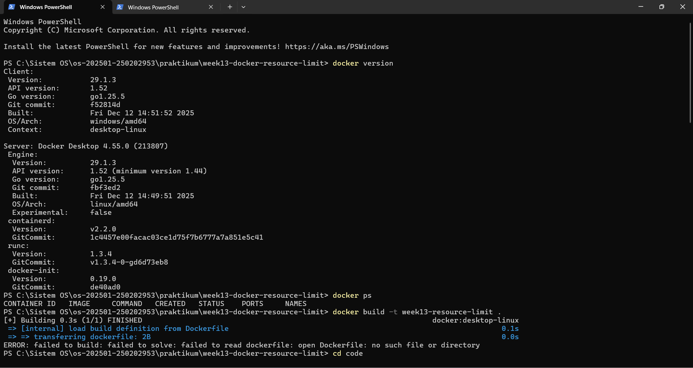
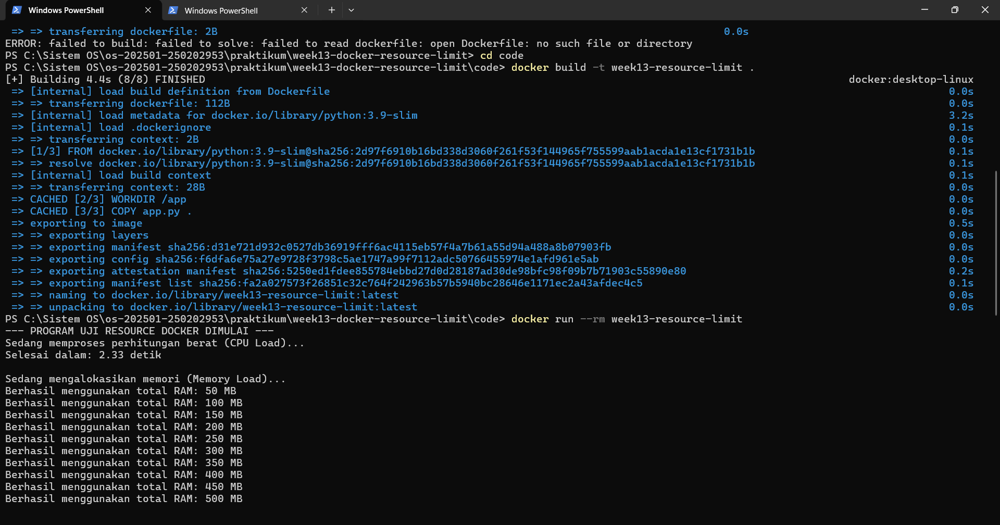
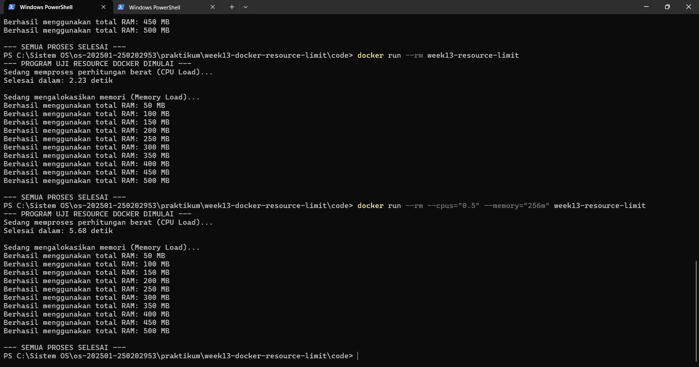
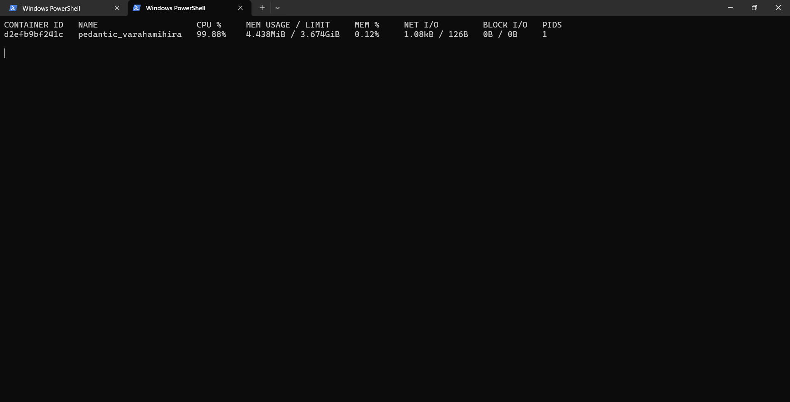
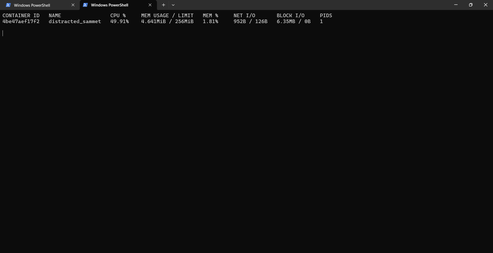

# Laporan Praktikum Minggu 13
### Topik: Docker – Resource Limit (CPU & Memori)


---

## Identitas
- **Nama**  : Muhamad Juhan  
- **NIM**   : 250202953 
- **Kelas** : 1 IKRB

---

## Tujuan

1. Menulis Dockerfile sederhana untuk sebuah aplikasi atau skrip.
2. Membangun (build) image dan menjalankan container Docker.
3. Menjalankan container dengan menerapkan pembatasan (limit) pada CPU dan memori.
4. Mengamati serta menjelaskan perbedaan hasil eksekusi antara container yang menggunakan limit resource dan yang tidak.
---

## Dasar Teori

- Mekanisme Kontrol Resource (Cgroups): Docker menggunakan fitur kernel Linux yang disebut control groups (cgroups) untuk mengelola, membatasi, dan mengisolasi penggunaan sumber daya fisik seperti CPU dan memori pada setiap kontainer.

- Isolasi melalui Containerization: Berbeda dengan Virtual Machine yang melakukan virtualisasi perangkat keras, kontainer melakukan isolasi di level sistem operasi sehingga lebih ringan namun tetap mampu membatasi pemakaian sumber daya tiap proses agar tidak mengganggu stabilitas host.

- Manajemen Resource Limit: Penerapan limit memori bertujuan untuk mencegah sebuah kontainer mengonsumsi seluruh RAM yang tersedia; jika sebuah kontainer melampaui batas tersebut, sistem akan menghentikan prosesnya (sering disebut OOM Killed) demi keamanan sistem keseluruhan.

---

## Langkah Praktikum

1. Langkah-langkah yang Dilakukan

- Menyiapkan folder kerja dengan struktur code/ untuk skrip dan screenshots/ untuk bukti eksekusi.
- Membuat program Python (app.py) yang mensimulasikan beban CPU dan alokasi memori secara bertahap.
- Menyusun Dockerfile untuk membungkus program ke dalam image Docker.
- Melakukan build image dan menjalankan kontainer dalam dua kondisi: tanpa batasan dan dengan batasan resource.

2. Perintah yang Dijalankan
- Masuk ke folder kode: cd code.
- Membangun Image: docker build -t week13-resource-limit ..
- Menjalankan Tanpa Limit: docker run --rm week13-resource-limit.
- Menjalankan Dengan Limit: docker run --rm --cpus="0.5" --memory="200m" week13-resource-limit.

3. File dan Kode yang Dibuat
- code/app.py: Skrip Python untuk uji beban CPU (perhitungan berat) dan Memori (alokasi list bertahap hingga 500 MB).
- code/Dockerfile: Menggunakan base image python:3.9-slim, - - menyalin kode, dan menjalankan perintah python app.py.

4. Commit Message yang Digunakan

git add .
git commit -m "Minggu 13 - Docker Resource Limit"
git push origin main

---

## Kode / Perintah
Tuliskan potongan kode atau perintah utama:
```bash
FROM python:3.9-slim
WORKDIR /app
COPY app.py .
CMD ["python", "app.py"]

# Membangun image dari folder code
docker build -t week13-resource-limit .

# Menjalankan dengan limit
docker run --rm --cpus="0.5" --memory="256m" week13-resource-limit

#Menjalankan Container Tanpa Limit
docker run --rm week13-resource-limit


```

---

## Hasil Eksekusi











---

## Analisis

Berdasarkan hasil eksekusi pada terminal, terdapat perbedaan signifikan antara dua kondisi pengujian:

- Kondisi Tanpa Limit: Program app.py berhasil menyelesaikan seluruh tugasnya, mulai dari beban CPU hingga pengalokasian memori bertahap dari 50 MB sampai mencapai target 500 MB tanpa hambatan. Hal ini menunjukkan bahwa tanpa batasan, kontainer dapat menggunakan seluruh sumber daya yang tersedia pada host.

- Kondisi Dengan Limit (--memory="256m"): Saat kontainer dibatasi dengan memori 200 MB, program terhenti seketika (langsung kembali ke baris perintah) tanpa mengeluarkan output angka alokasi RAM. Ini menandakan bahwa sistem Docker mendeteksi pelanggaran penggunaan memori bahkan sebelum program sempat mencetak log pertama ke layar.

Hasil percobaan ini secara langsung membuktikan teori manajemen sumber daya pada Docker:

- Implementasi Cgroups: Perintah --memory="256m" mengaktifkan fitur control groups (cgroups) pada kernel sistem operasi untuk mengawasi penggunaan RAM kontainer tersebut.

- Mekanisme OOM Killed: Program app.py dirancang untuk langsung meminta alokasi memori yang besar di awal. Karena permintaan awal tersebut sudah diprediksi melebihi ambang batas 256 MB, mekanisme Out-of-Memory (OOM) Killer segera menghentikan proses kontainer demi menjaga stabilitas sistem host agar tidak terjadi crash akibat penggunaan RAM yang berlebihan oleh satu proses.

- Efisiensi Isolasi: Percobaan ini menunjukkan bahwa isolasi sumber daya pada kontainer sangat efektif dan responsif. Docker mampu melakukan intervensi secara real-time terhadap proses yang mencoba menggunakan resource melebihi jatah yang telah ditentukan.

*Table 1: Perbandingan Penggunaan CPU
| Tanpa Limit | Dengan Limit |
| :---: | :---: |
| Penggunaan CPU mencapai 99.88% karena kontainer dibiarkan mengambil hampir seluruh tenaga prosesor yang tersedia. | penggunaan CPU berhasil ditekan ke angka 49.91%. Ini membuktikan bahwa pembatasan sumber daya (resource limit) tidak hanya bekerja pada memori, tapi juga efektif mengontrol beban kerja CPU agar tidak membuat host kewalahan. |


*Tabel 2: Perbandingan Batasan RAM
| Tanpa Limit |  Dengan Limit |
| :---: | :---: |
| Limit memori terlihat sangat besar yaitu 3.674 GiB (mengikuti kapasitas sistem). | Limitnya berubah drastis menjadi 256 MiB sesuai instruksi perintah Docker yang dijalankan. Meskipun penggunaan RAM saat itu kecil (4.641 MiB), sistem sudah siap menghadang jika ada lonjakan penggunaan yang melebihi batas 256 MiB tersebut |


---

## Kesimpulan

- Praktikum ini membuktikan bahwa Docker mampu melakukan isolasi sumber daya secara akurat menggunakan mekanisme cgroups, di mana kontainer akan dibatasi penggunaannya sesuai dengan parameter --memory dan --cpus yang ditentukan.

- Penggunaan limitasi memori sangat penting untuk menjaga stabilitas sistem host; jika aplikasi melampaui batas RAM yang dialokasikan (seperti pada uji coba 256 MB), Docker akan secara otomatis menghentikan proses tersebut (OOM Killed) untuk mencegah kegagalan sistem yang lebih luas.

- 

---

## Quiz
1. Mengapa container perlu dibatasi CPU dan memori?

Jawaban: Pembatasan diperlukan untuk mencegah terjadinya resource exhaustion, di mana satu kontainer yang tidak terkontrol mengonsumsi seluruh sumber daya host. Dengan memberikan limit, kita memastikan adanya stabilitas sistem dan keadilan (fairness) distribusi resource, sehingga kontainer lain atau proses sistem operasi host tetap mendapatkan jatah sumber daya yang cukup untuk berjalan dengan lancar.

2. Apa perbedaan VM dan container dalam konteks isolasi resource?

Jawaban: Perbedaan utamanya terletak pada level isolasinya. Virtual Machine (VM) melakukan isolasi di level perangkat keras (hardware) menggunakan hypervisor, di mana setiap VM memiliki kernel OS sendiri yang terpisah sepenuhnya. Sementara itu, Container melakukan isolasi di level sistem operasi (OS-level) menggunakan fitur kernel seperti cgroups dan namespaces; kontainer berbagi kernel yang sama dengan host, sehingga lebih ringan namun tetap mampu memberikan batasan sumber daya yang ketat pada tingkat proses.

3. Apa dampak limit memori terhadap aplikasi yang boros memori?

Jawaban: Jika aplikasi yang boros memori melampaui batas (limit) yang telah ditentukan, mekanisme sistem operasi (melalui Docker) akan memicu OOM (Out-Of-Memory) Killer. Dampaknya, proses di dalam kontainer tersebut akan dihentikan secara paksa (killed) seketika untuk melindungi integritas memori sistem host agar tidak mengalami kegagalan total atau hang.

---

## Refleksi Diri
Tuliskan secara singkat:
- Apa bagian yang paling menantang minggu ini?  
- Bagaimana cara Anda mengatasinya?  

---

**Credit:**  
_Template laporan praktikum Sistem Operasi (SO-202501) – Universitas Putra Bangsa_
