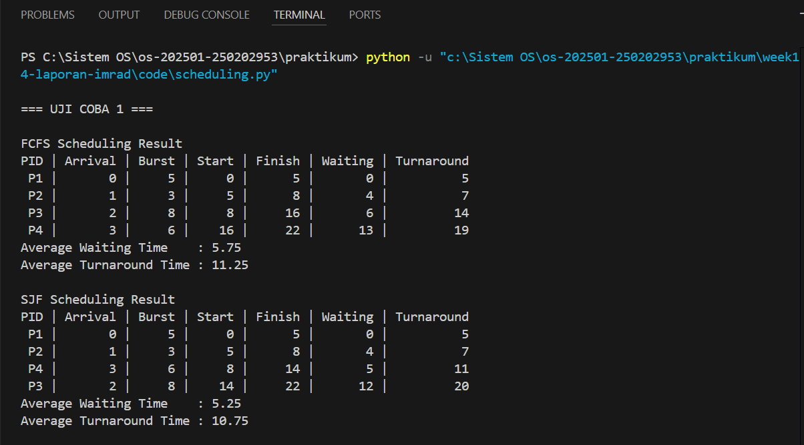
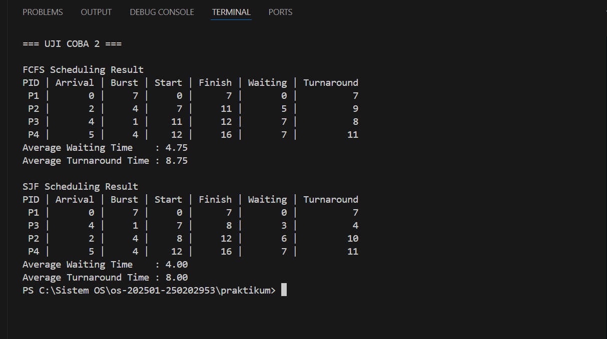

# Laporan Praktikum Minggu 14
Topik: Penyusunan Laporan Praktikum Format IMRAD

---

## Identitas
- **Nama**  : Muhamad Juhan  
- **NIM**   : 250202953  
- **Kelas** : 1 IKRB

---

### Judul

#### Analisis Perbandingan Performa Algoritma Penjadwalan First-Come, First-Served (FCFS) dan Shortest Job First (SJF)

---

## 1. Introduction (Pendahuluan)
### 1.1 Latar Belakang

Sistem operasi modern dituntut untuk mampu menjalankan berbagai proses secara bersamaan (multitasking). Dalam kondisi ini, CPU sebagai unit pemrosesan utama menjadi sumber daya yang diperebutkan oleh banyak proses. Oleh karena itu, diperlukan sebuah mekanisme penjadwalan CPU untuk menentukan urutan eksekusi proses yang berada di dalam antrean (ready queue). Efisiensi dari algoritma penjadwalan sangat berpengaruh pada pengalaman pengguna dan performa sistem secara keseluruhan.

Dua algoritma klasik yang sering digunakan dalam studi sistem operasi adalah First-Come, First-Served (FCFS) dan Shortest Job First (SJF). FCFS bekerja dengan prinsip antrean sederhana di mana proses yang tiba lebih dulu akan dilayani lebih dulu. Namun, FCFS sering kali menghadapi masalah "convoy effect" di mana proses-proses pendek harus menunggu proses panjang selesai. Sebagai alternatif, SJF hadir dengan memprioritaskan proses dengan durasi (burst time) terpendek guna meminimalkan rata-rata waktu tunggu (Average Waiting Time).

Tujuan dari praktikum ini adalah untuk melakukan simulasi koding menggunakan bahasa Python guna membandingkan performa FCFS dan SJF secara langsung. Analisis difokuskan pada dua parameter utama, yaitu Average Waiting Time (AWT) dan Average Turnaround Time (ATT), untuk membuktikan algoritma mana yang lebih efisien dalam berbagai skenario beban kerja proses.

---

## 1.2 Rumusan Masalah

1. Bagaimana perbedaan urutan eksekusi antara algoritma FCFS dan SJF ketika dihadapkan pada skenario proses yang sama di Uji Coba 1 dan Uji Coba 2?

2. Apakah algoritma SJF selalu menghasilkan Average Waiting Time yang lebih rendah dibandingkan FCFS pada kedua skenario uji coba tersebut?

3. Seberapa besar pengaruh perubahan durasi proses (burst time) pada Uji Coba 2 terhadap efisiensi waktu tunggu di masing-masing algoritma?

## 1.3 Tujuan

1. Mensimulasikan algoritma FCFS dan SJF menggunakan Python melalui dua skenario pengujian yang berbeda.

2. Membandingkan metrik Average Waiting Time dan Average Turnaround Time antara FCFS dan SJF berdasarkan output terminal.

3. Menganalisis fenomena pergeseran antrean pada SJF di Uji Coba 2 yang bertujuan untuk mengoptimalkan efisiensi waktu tunggu sistem.

---

## 2. Methods (Metode)
## 2.1 Lingkungan Pengujian

 Pengujian dilakukan pada perangkat keras yang sama untuk memastikan konsistensi hasil. Spesifikasi perangkat keras dan perangkat lunak yang digunakan adalah sebagai berikut:

 A. Perangkat Keras (Host Machine)

Model Laptop: Axioo Hype 5 X3

Processor (CPU): AMD Ryzen 5 3500U

RAM: 8 GB 

Sistem Operasi: Windows 11 64-bit

B. Perangkat Lunak (Software)

IDE: Visual Studio Code

Bahasa Pemrograman: Python 3.14.2

File Eksekusi: scheduling.py

## 2.2 Prosedur Pengujian

A. Menyiapkan skrip simulasi scheduling.py yang berisi logika algoritma FCFS dan SJF.

B. Menentukan parameter input berupa Arrival Time dan Burst Time untuk 4 proses (P1, P2, P3, P4).

C. Menjalankan program melalui terminal terintegrasi di VS Code.

D. Mencatat hasil Waiting Time dan Turnaround Time yang muncul pada output terminal.

E. Melakukan perbandingan hasil antara kedua algoritma untuk ditarik kesimpulannya.

## 2.3 Variabel Pengukuran

- Waiting Time (WT): Durasi waktu yang dihabiskan oleh suatu proses di dalam antrean (ready queue) menunggu jatah eksekusi CPU.

- Turnaround Time (TAT): Total waktu yang dibutuhkan dari saat proses masuk ke sistem hingga proses tersebut selesai dieksekusi (TAT = WAKTU SELESAI - WAKTU TIBA).

- Average Waiting Time: Rata-rata waktu tunggu dari seluruh proses yang diuji. Ini adalah indikator utama efisiensi algoritma.

- Average Turnaround Time: Rata-rata waktu penyelesaian dari seluruh proses yang diuji.

## 2.4 Skenario Pengujian

Data input yang digunakan dalam pengujian ini dibagi menjadi dua skenario:
- **Uji Coba 1:** Menggunakan variasi durasi burst sedang (3-8 ms) untuk melihat kinerja dasar FCFS dan SJF.
- **Uji Coba 2:** Memasukkan satu proses dengan burst time sangat pendek (1 ms) untuk mengamati bagaimana SJF mengoptimalkan antrean dibandingkan FCFS.

---

## 3. Results (Hasil)

## 3.1 Tabel Perbandingan Output Terminal

| Hasil | Keterangan |
| :--- | :--- |
|  | Uji Coba 1: SJF (AWT 5.25) lebih unggul dari FCFS (AWT 5.75).            |
|  | Uji Coba 2: SJF (AWT 4.00) jauh lebih efisien dibanding FCFS (AWT 4.75). |

## 3.2 Analisis Hasil Pengujian

Analisis Uji Coba 1: Berdasarkan pengujian pertama, terlihat bahwa algoritma SJF berhasil meminimalkan waktu tunggu rata-rata menjadi 5.25. Hal ini membuktikan bahwa mendahulukan proses dengan burst lebih pendek dapat meningkatkan responsivitas sistem pada laptop Axioo Hype 5.

Analisis Uji Coba 2: Pada pengujian kedua, efisiensi semakin terlihat jelas. Dengan adanya proses P3 yang memiliki Burst Time hanya 1, SJF langsung menempatkannya di awal antrean (setelah P1), sehingga memangkas Average Waiting Time secara signifikan menjadi 4.00.

## 4. Discussion (Pembahasan)

## 4.1 Analisis Perbandingan Algoritma

Berdasarkan hasil simulasi, terlihat bahwa Shortest Job First (SJF) secara konsisten memberikan nilai Average Waiting Time (AWT) yang lebih rendah dibandingkan FCFS. Pada Uji Coba 2, performa SJF meningkat signifikan karena algoritma ini mendeteksi proses P3 yang memiliki Burst Time terkecil (1 ms) dan memprioritaskannya. Hal ini membuktikan bahwa SJF mampu meminimalkan penumpukan antrean.

## 4.2 Relevansi dengan Perangkat Keras
Pengujian pada laptop Axioo Hype 5 X3 menunjukkan bahwa manajemen proses yang efisien sangat bergantung pada algoritma yang digunakan. Meskipun CPU AMD Ryzen 5 memiliki performa tinggi, efisiensi waktu tunggu proses tetap ditentukan oleh kecerdasan algoritma penjadwalan dalam mengatur antrean di memori.

## 4.3 Kelebihan dan Kekurangan Algoritma

A. First-Come, First-Served (FCFS)

Kelebihan: Sangat mudah diimplementasikan dan adil dalam hal urutan kedatangan proses karena tidak memerlukan estimasi waktu eksekusi.

Kekurangan: Sering terjadi convoy effect, di mana proses pendek harus menunggu sangat lama jika ada proses panjang yang datang lebih dulu, sehingga meningkatkan Average Waiting Time.

B. Shortest Job First (SJF)

Kelebihan: Memberikan Average Waiting Time minimum untuk sekumpulan proses yang tersedia dan sangat efisien untuk menangani proses-proses pendek.

Kekurangan: Berisiko menyebabkan starvation (kelaparan), di mana proses dengan burst time besar mungkin tidak akan pernah dieksekusi jika proses pendek terus-menerus datang ke dalam antrean.

## 5. Closing (Penutup)

## 5.1 Kesimpulan
Berdasarkan hasil simulasi dan analisis yang telah dilakukan, dapat disimpulkan bahwa algoritma Shortest Job First (SJF) memiliki efisiensi yang lebih tinggi dibandingkan First-Come, First-Served (FCFS). Hal ini dibuktikan dengan nilai Average Waiting Time (AWT) yang lebih kecil pada setiap skenario pengujian di laptop Axioo Hype 5. Strategi SJF dalam mendahulukan proses dengan durasi burst terpendek terbukti efektif meminimalkan antrean di dalam sistem.

## 5.2 Saran

Untuk pengembangan praktikum selanjutnya, disarankan untuk melakukan pengujian dengan jumlah proses yang lebih banyak (lebih dari 4 proses) guna mengamati konsistensi performa algoritma pada beban kerja yang lebih tinggi. Selain itu, disarankan pula untuk mencoba variasi algoritma lain seperti Round Robin (RR) atau Priority Scheduling. Hal ini bertujuan untuk mendapatkan perbandingan performa sistem secara lebih komprehensif, terutama dalam menangani skenario proses yang memiliki prioritas berbeda atau membutuhkan pembagian waktu (time slice) yang adil.

---

## Daftar Pustaka

Kristanto, A. (2023). Sistem Operasi: Konsep dan Implementasi. Gava Media.

Rahmansyah, A. (2022). Manajemen Proses dan Penjadwalan CPU dalam Sistem Operasi Modern. Informatika Bandung.

Python Software Foundation. (2026). Dokumentasi Resmi Python 3.14.2.

Microsoft Corporation. (2026). Visual Studio Code Documentation.

---

## Quiz

1. Mengapa format IMRAD membantu membuat laporan praktikum lebih ilmiah dan mudah dievaluasi?

Format IMRAD membuat laporan lebih ilmiah karena menyediakan struktur standar yang memisahkan data objektif dari opini pribadi, sehingga alur logika penelitian menjadi sangat sistematis dan mudah diikuti. Hal ini memudahkan evaluasi karena dosen dapat langsung memverifikasi bagian spesifik, seperti akurasi prosedur pada Methods atau angka temuan pada Results, tanpa harus membaca keseluruhan teks. Selain itu, format ini menjamin transparansi yang memungkinkan orang lain mengulang praktikum tersebut dengan hasil serupa, sehingga meningkatkan kredibilitas dan kualitas akademik laporan kamu

2. Apa perbedaan antara bagian Hasil dan Pembahasan?

- Bagian Hasil berfungsi untuk menyajikan data temuan secara objektif berdasarkan simulasi yang telah dilakukan, seperti tabel nilai Average Waiting Time dan Average Turnaround Time serta bukti tangkapan layar terminal.

- Bagian Pembahasan digunakan untuk menginterpretasikan data tersebut dengan menjelaskan alasan logis di balik angka-angka yang muncul, seperti mengapa algoritma SJF terbukti lebih efisien daripada FCFS dalam menangani antrean proses. Perbedaan mendasarnya terletak pada fokus penyajiannya, di mana Hasil memaparkan fakta angka yang didapat, sedangkan Pembahasan mengupas keterkaitan antara data tersebut dengan teori sistem operasi yang digunakan.

3. Mengapa sitasi dan daftar pustaka penting, bahkan untuk laporan praktikum?

- Pencantuman sitasi dan daftar pustaka merupakan aspek krusial dalam laporan praktikum untuk menjaga integritas akademik serta menghindari praktik plagiarisme dengan mengakui sumber pemikiran asli dari penulis lain. Keberadaan referensi yang jelas, seperti buku teks sistem operasi atau dokumentasi resmi perangkat lunak, membuktikan bahwa metodologi dan analisis yang digunakan memiliki dasar teori yang kuat dan dapat dipertanggungjawabkan kebenarannya.

---

**Credit:**  
_Template laporan praktikum Sistem Operasi (SO-202501) – Universitas Putra Bangsa_
