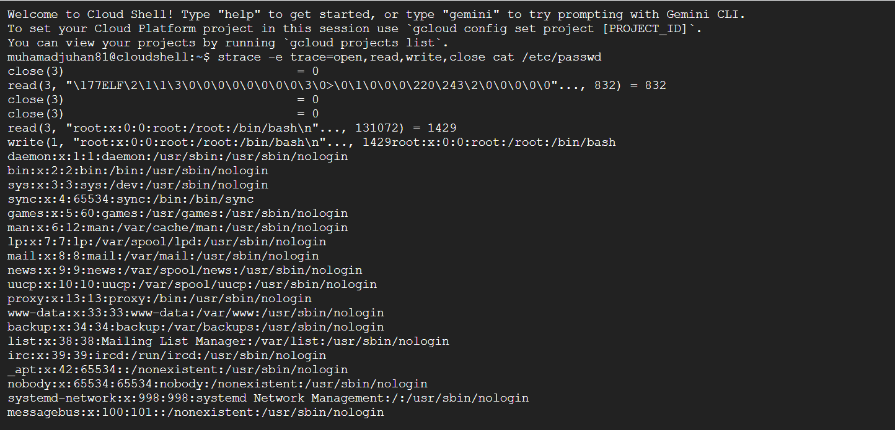
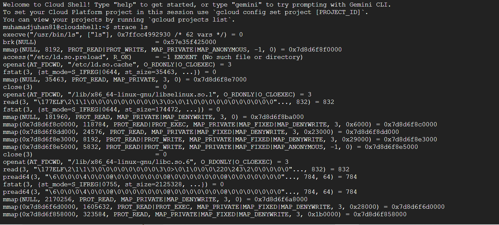
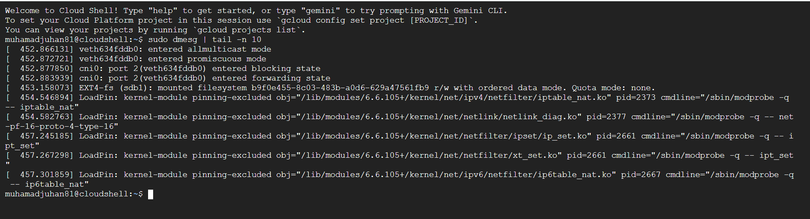
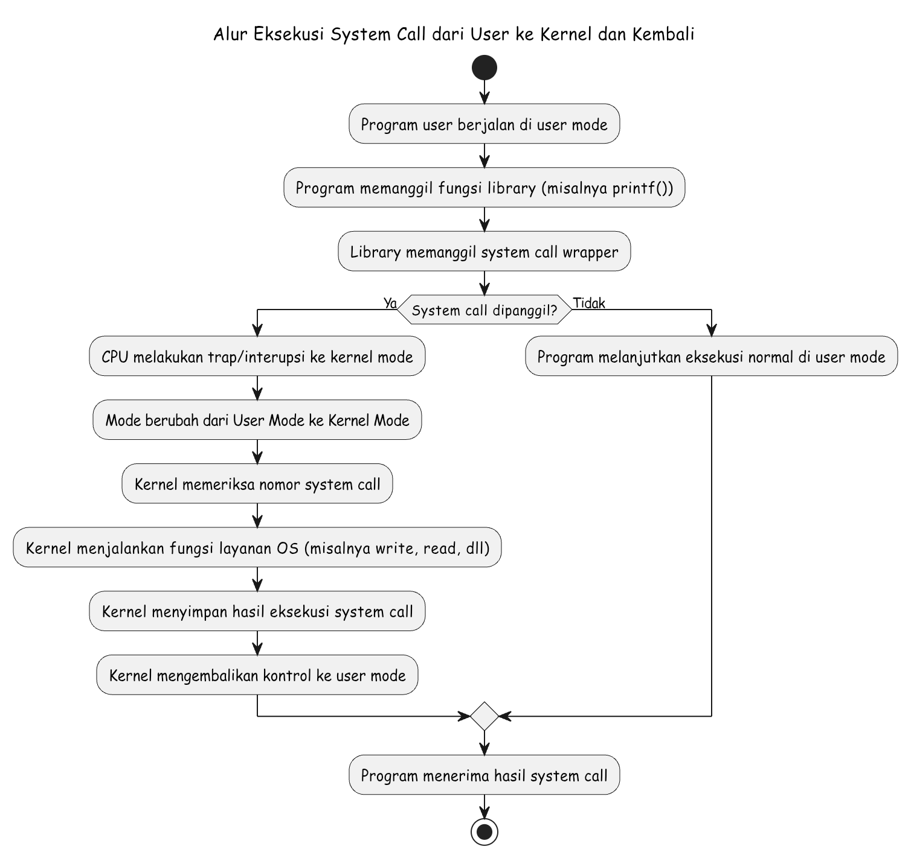

# Laporan Praktikum Minggu [X]
Topik: syscall structures

---

## Identitas
- **Nama**  : Muhamad Juhan
- **NIM**   : 250202953
- **Kelas** : 1 ikrb

---

## Tujuan
Tujuan dari praktikum ini adalah untuk memahami bagaimana system call bekerja di dalam sistem operasi. Melalui percobaan ini, mahasiswa diharapkan dapat menjelaskan konsep dan fungsi system call, mengenali jenis-jenisnya beserta fungsinya, serta mengamati bagaimana proses perpindahan dari user mode ke kernel mode terjadi saat sebuah system call dipanggil. Selain itu, mahasiswa juga belajar menggunakan beberapa perintah di Linux untuk menampilkan dan menganalisis aktivitas system call yang dijalankan oleh suatu program.

---

## Dasar Teori
1. Fungsi utama sistem operasi adalah mengelola seluruh sumber daya komputer agar dapat digunakan secara efisien oleh pengguna maupun program. Sistem operasi bertanggung jawab terhadap pengaturan proses, memori, berkas, serta perangkat input/output.
2. Kernel merupakan inti dari sistem operasi yang berperan langsung dalam mengontrol perangkat keras dan menjalankan instruksi penting. Kernel mengatur komunikasi antara perangkat keras dan perangkat lunak agar setiap proses dapat berjalan dengan aman dan stabil.
3. System call berfungsi sebagai jembatan antara program pengguna (user mode) dengan layanan yang disediakan oleh kernel (kernel mode). Melalui system call, program dapat meminta layanan sistem seperti membaca file, membuat proses baru, atau mengatur memori tanpa harus berinteraksi langsung dengan perangkat keras.
4. Pemisahan antara user mode dan kernel mode dibuat untuk menjaga keamanan sistem. Dengan cara ini, program pengguna tidak bisa langsung mengakses bagian sensitif dari sistem operasi, sehingga risiko kesalahan atau kerusakan dapat diminimalkan.

---

## Langkah Praktikum
1. Membuka terminal pada sistem operasi yang digunakan misalnya Linux
2. Membuat file program baru menggunakan teks editor
3. Menulis kode program sederhana yang menggunakan system call, misalnya untuk menampilkan teks atau membaca file.
4. Menyimpan file, kemudian melakukan kompilasi program menggunakan perintah gcc atau perintah lain yang sesuai.
5. Menjalankan hasil kompilasi untuk melihat bagaimana program berinteraksi dengan sistem operasi melalui system call.
6. Melakukan pengujian beberapa kali untuk memastikan hasil yang ditampilkan sesuai dengan fungsi yang diharapkan.
7. Menyimpan perubahan ke dalam repositori Git dengan pesan (commit message) yang menjelaskan kegiatan yang dilakukan.

---

## Kode / Perintah
strace ls

strace -e trace=open,read,write,close cat /etc/passwd

dmesg | tail -n 10

---

## Hasil Eksekusi
Sertakan screenshot hasil percobaan atau diagram:

---

## Analisis
| No. | Perintah | Output | Penjelasan |
|---|----|---|---|

- Makna Hasil Percobaan

Dari hasil percobaan yang dilakukan, dapat dipahami bahwa setiap program yang dijalankan di sistem operasi sebenarnya memanggil sejumlah system call untuk berinteraksi dengan kernel. Saat perintah strace dijalankan, terlihat berbagai system call yang digunakan, seperti open, read, write, dan exit. Hal ini menunjukkan bahwa meskipun program terlihat sederhana, sistem operasi tetap melakukan serangkaian proses di belakang layar agar instruksi tersebut dapat dieksekusi dengan benar. Percobaan ini juga memperlihatkan bagaimana terjadi perpindahan dari user mode ke kernel mode saat system call dijalankan. Proses ini penting untuk menjaga keamanan dan kestabilan sistem, karena mencegah program pengguna mengakses perangkat keras atau sumber daya penting secara langsung. Dengan memahami hasil percobaan ini, mahasiswa dapat melihat peran nyata kernel dalam menangani permintaan dari program pengguna.

- Hubungkan hasil dengan teori

Hasil percobaan yang diperoleh sesuai dengan teori yang menjelaskan bahwa system call adalah antarmuka antara program pengguna dan kernel. Dalam teori, disebutkan bahwa setiap kali program membutuhkan layanan dari sistem, seperti membaca file atau menulis ke layar, permintaan tersebut dikirim ke kernel melalui system call. Hal ini terbukti dalam percobaan menggunakan strace, di mana setiap aktivitas program ditampilkan dalam bentuk daftar system call yang dijalankan. Selain itu, teori juga menjelaskan adanya dua mode kerja, yaitu user mode dan kernel mode. Hasil percobaan mendukung teori ini, karena setiap system call yang muncul menandakan adanya perpindahan sementara dari user mode ke kernel mode. Dengan demikian, percobaan ini tidak hanya memperlihatkan cara kerja system call secara praktis, tetapi juga menguatkan pemahaman teori tentang bagaimana sistem operasi mengatur interaksi antara program dan perangkat keras.

- Apa perbedaan hasil di lingkungan OS berbeda (Linux vs Windows)

Secara umum, percobaan system call di Linux dan Windows menghasilkan fungsi yang sama, yaitu sebagai sarana bagi program untuk berinteraksi dengan sistem operasi. Namun, cara kerja dan implementasinya memiliki beberapa perbedaan yang cukup jelas. 
Pada sistem Linux, system call bersifat lebih terbuka dan terdokumentasi dengan baik, sehingga pengguna atau pengembang dapat dengan mudah melihat daftar system call yang tersedia beserta cara kerjanya. Linux juga memberikan akses yang lebih langsung ke level kernel, sehingga hasil percobaan biasanya dapat diamati secara lebih detail, misalnya melalui penggunaan terminal atau perintah sistem seperti strace untuk menelusuri aktivitas system call yang terjadi. Sementara pada sistem Windows, mekanisme system call cenderung lebih tertutup dan kompleks. Akses langsung ke level kernel dibatasi, dan sebagian besar interaksi dilakukan melalui API (Application Programming Interface) milik Windows. Akibatnya, saat percobaan dilakukan di Windows, hasil yang terlihat tidak sejelas di Linux karena banyak proses berlangsung di latar belakang tanpa dapat diamati secara langsung.
Dengan demikian, perbedaan utama antara keduanya terletak pada tingkat keterbukaan, cara pemanggilan system call, serta kemudahan observasi hasilnya. Linux lebih transparan dan mudah dipelajari untuk keperluan praktikum sistem operasi, sedangkan Windows lebih fokus pada keamanan dan kestabilan dengan membatasi akses langsung ke kernel.

---

## Kesimpulan

1. Dari hasil praktikum yang dilakukan, dapat disimpulkan bahwa system call berperan penting sebagai jembatan antara program pengguna dengan kernel sistem operasi. Melalui system call, program dapat meminta layanan tertentu dari sistem, seperti membaca file, menulis data, atau membuat proses baru tanpa harus berinteraksi langsung dengan perangkat keras.

2. Percobaan menggunakan perintah strace di Linux menunjukkan bahwa setiap program sebenarnya menjalankan banyak system call di balik layar. Hal ini juga memperlihatkan adanya perpindahan kerja dari user mode ke kernel mode setiap kali system call terjadi, yang bertujuan menjaga keamanan serta kestabilan sistem.

3. Secara keseluruhan, praktikum ini membantu memahami bagaimana sistem operasi mengatur komunikasi antara pengguna dan perangkat keras melalui peran kernel dan system call.

---

## Quiz
1. Apa fungsi utama system call dalam sistem operasi ?

Fungsi utama system call adalah sebagai penghubung antara program pengguna dengan sistem operasi. Melalui system call, program dapat meminta layanan tertentu dari kernel, seperti membaca atau menulis file, membuat proses baru, mengalokasikan memori, atau berinteraksi dengan perangkat keras. Dengan adanya mekanisme ini, program dapat menjalankan operasi penting tanpa harus mengetahui detail teknis dari sistem operasi atau perangkat keras yang digunakan. Selain itu, system call juga berperan menjaga keamanan dan kestabilan sistem dengan membatasi akses langsung dari program ke sumber daya inti komputer.

2. Sebutkan 4 kategori system call yang umum digunakan.

Secara umum, system call dapat dibagi menjadi beberapa kategori utama, di antaranya

-Manajemen proses 
digunakan untuk membuat, menjalankan, menghentikan, dan mengatur proses.

-Manajemen berkas
berkaitan dengan operasi pada file seperti membuka, membaca, menulis, dan menutup file.

-Manajemen memori
 digunakan untuk mengatur alokasi dan pembebasan ruang memori yang digunakan oleh proses.
 
-Komunikasi antar proses
 berfungsi untuk pertukaran data atau koordinasi antar proses.

3. Mengapa system call tidak bisa dipanggil langsung oleh user program?

System call tidak bisa dipanggil langsung oleh program pengguna karena alasan keamanan dan proteksi sistem. Program yang berjalan di user mode tidak memiliki izin untuk mengakses sumber daya penting seperti memori kernel atau perangkat keras. Jika akses ini dibiarkan terbuka, maka kesalahan kecil dalam program bisa merusak seluruh sistem atau menyebabkan kebocoran data. Oleh karena itu, setiap permintaan dari program ke sistem operasi harus melewati mekanisme system call. Proses ini memastikan bahwa kernel dapat memeriksa dan memvalidasi permintaan tersebut sebelum dijalankan. Dengan cara ini, sistem tetap aman, stabil, dan terlindungi dari tindakan yang tidak diinginkan.

---

## Refleksi Diri
Tuliskan secara singkat:
- Apa bagian yang paling menantang minggu ini?  
- Bagaimana cara Anda mengatasinya?  

---

**Credit:**  
_Template laporan praktikum Sistem Operasi (SO-202501) – Universitas Putra Bangsa_
