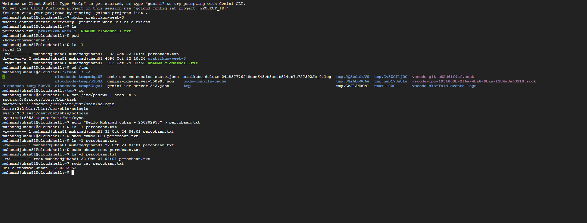

# Laporan Praktikum Minggu 3
Topik: linux fs permission

---

## Identitas
- **Nama**  : Muhamad Juhan
- **NIM**   : 250202953
- **Kelas** : 1ikrb

---

## Tujuan
Tujuan dari praktikum ini adalah untuk memberikan pemahaman dan keterampilan kepada mahasiswa dalam mengelola file serta direktori menggunakan perintah dasar Linux. Melalui kegiatan ini, mahasiswa diharapkan mampu melakukan navigasi sistem file, mengatur hak akses (permission), dan mengubah kepemilikan (ownership) file dengan benar

---

## Dasar Teori
-Struktur Sistem File Linux

 Linux memiliki struktur sistem file yang berbentuk hierarki, dimulai dari direktori root. Semua file dan folder tersusun secara berurutan di bawahnya, sehingga pengguna perlu memahami cara navigasi untuk mengelola file dengan benar.

-Perintah Dasar Linux

 Beberapa perintah penting seperti ls, pwd, cd, dan cat digunakan untuk melihat daftar file, mengetahui posisi direktori saat ini, berpindah direktori, dan menampilkan isi file. Penguasaan perintah dasar ini merupakan langkah awal dalam penggunaan sistem Linux.

-Hak Akses (Permission)

 Setiap file dan direktori di Linux memiliki hak akses yang mengatur siapa yang boleh membaca, menulis, atau mengeksekusi file tersebut. Pengaturan dilakukan dengan perintah chmod untuk menjaga keamanan dan pengelolaan data.

-Kepemilikan File (Ownership)

 File di Linux memiliki pemilik (user) dan grup (group). Perintah chown digunakan untuk mengubah kepemilikan tersebut agar pengelolaan file sesuai dengan hak pengguna yang berwenang.

---

## Langkah Praktikum

1. Masuk ke direktori kerja praktikum/week3-linux-fs-permission/.

2. Menjalankan perintah dasar Linux seperti pwd, ls -l, cd, dan ls -a untuk melihat lokasi dan isi direktori.

3. Membaca sebagian isi file /etc/passwd menggunakan cat untuk melihat informasi user pada sistem.

4. Membuat file baru bernama percobaan.txt yang berisi identitas diri, kemudian memeriksa permission-nya.

5. Mengubah permission file menggunakan chmod 600.

6. Mengubah pemilik file dengan chown jika memiliki akses sudo.

7. Mengambil screenshot hasil eksekusi terminal dan menyimpannya pada folder screenshots/.

8. Melakukan git add, git commit, dan git push untuk mengunggah hasil ke GitHub.


---

## Kode / Perintah
Tuliskan potongan kode atau perintah utama:
```bash
pwd
ls -l
cd /tmp
ls -a
cat /etc/passwd | head -n 5
echo "Hello <NAME><NIM>" > percobaan.txt
ls -l percobaan.txt
chmod 600 percobaan.txt
ls -l percobaan.txt

```

---

## Hasil Eksekusi
Sertakan screenshot hasil percobaan atau diagram:




---

## Analisis

Berdasarkan hasil praktikum, dapat disimpulkan bahwa pengelolaan file dan direktori di sistem operasi Linux sangat bergantung pada pemahaman terhadap perintah dasar serta sistem izin aksesnya. Melalui penggunaan perintah seperti ls, pwd, cd, dan cat, saya dapat memahami cara berpindah dan menampilkan isi direktori dengan lebih efisien.
Penerapan perintah chmod juga memberikan pemahaman tentang pentingnya pengaturan hak akses agar file tidak disalahgunakan oleh pengguna lain. Dengan mengetahui arti setiap kombinasi permission seperti rwxr-xr--, saya dapat menentukan izin yang sesuai untuk setiap kebutuhan.

Selain itu, perintah chown membantu saya memahami konsep kepemilikan file, di mana pengaturan pemilik dan grup sangat berpengaruh terhadap keamanan dan pengelolaan sistem.
Secara keseluruhan, praktikum ini membantu saya memahami bahwa pengelolaan file di Linux tidak hanya sekadar menyimpan data, tetapi juga melibatkan pengaturan hak akses dan kepemilikan yang tepat agar sistem tetap aman, teratur, dan efisien.


---

## Kesimpulan
-Dari praktikum ini, saya belajar cara menggunakan perintah dasar Linux seperti ls, pwd, cd, dan cat untuk menavigasi serta mengelola file dan direktori dengan lebih efektif.

-Saya juga memahami bagaimana perintah chmod dan chown digunakan untuk mengatur hak akses dan kepemilikan file, sehingga keamanan dan pengelolaan sistem dapat terjaga dengan baik.

-Secara keseluruhan, praktikum ini membuat saya lebih paham tentang cara kerja sistem file di Linux dan pentingnya pengaturan izin serta kepemilikan dalam menjaga keteraturan sistem.

---

## Quiz
1. Fungsi dari perintah chmod
   
Perintah chmod berfungsi untuk mengatur atau mengubah hak akses pada file maupun direktori di sistem Linux. Dengan perintah ini, kita bisa menentukan siapa yang diperbolehkan untuk membaca, menulis, atau menjalankan suatu file. Tujuan utamanya adalah untuk menjaga keamanan data agar hanya pengguna yang berhak saja yang bisa melakukan tindakan tertentu terhadap file tersebut.

2. Arti dari kode permission rwxr-xr--

Kode rwxr-xr-- menunjukkan pembagian hak akses file menjadi tiga bagian utama:

rwx : untuk pemilik (user), artinya pemilik file dapat membaca, mengedit, dan menjalankan file tersebut.

r-x : untuk grup (group), artinya anggota grup hanya bisa membaca dan menjalankan file, tetapi tidak dapat mengubah isinya.

r-- : untuk pengguna lain (others), artinya mereka hanya dapat melihat atau membaca file tanpa bisa mengedit ataupun menjalankannya.

3. Perbedaan antara chown dan chmod

Perintah chown digunakan untuk mengganti kepemilikan suatu file atau direktori, baik dari sisi pengguna (user) maupun grupnya. Sedangkan chmod digunakan untuk mengubah hak akses terhadap file, seperti siapa yang boleh membaca, menulis, atau menjalankannya. Jadi, chown mengatur siapa pemilik file, sedangkan chmod mengatur apa yang bisa dilakukan terhadap file tersebut.
 

---

## Refleksi Diri


---

**Credit:**  
_Template laporan praktikum Sistem Operasi (SO-202501) – Universitas Putra Bangsa_
