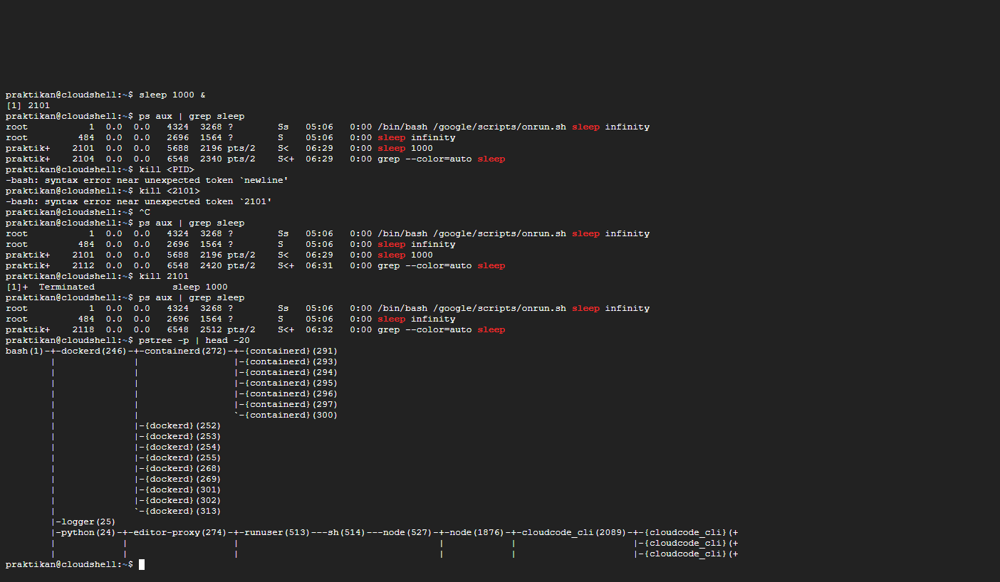
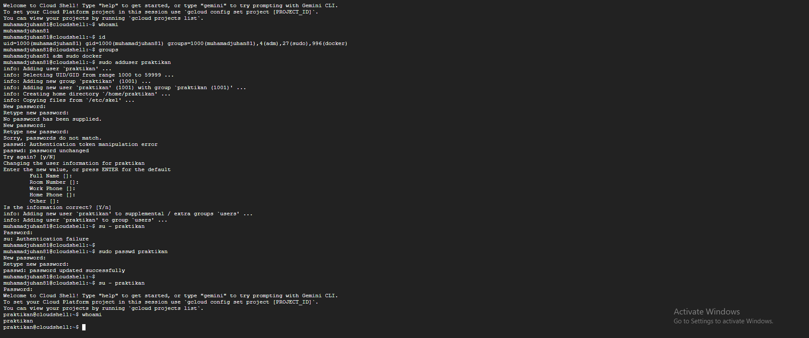
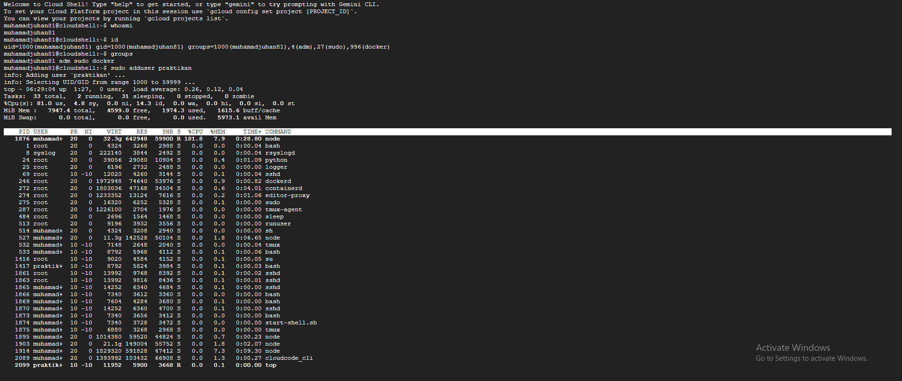

# Laporan Praktikum Minggu 4
Topik: Manajemen Proses dan User di Linux

---

## Identitas
- **Nama**  : Muhamad Juhan
- **NIM**   :250202953
- **Kelas** :1 ikrb

---

## Tujuan

Tujuan dari praktikum ini adalah untuk memahami lebih dalam bagaimana sistem operasi Linux mengelola proses dan pengguna. Melalui kegiatan praktikum, saya belajar bagaimana cara menampilkan dan memantau proses yang sedang berjalan, termasuk memahami status dari setiap proses yang ada di sistem. Selain itu, saya juga mempelajari bagaimana membuat dan mengatur user serta group menggunakan perintah dasar seperti adduser, passwd, id, dan groups. Praktikum ini juga memberikan pemahaman tentang bagaimana cara menghentikan atau mengontrol proses tertentu melalui PID dengan menggunakan perintah seperti kill atau top. Dari keseluruhan kegiatan, saya dapat memahami hubungan antara manajemen user dengan keamanan sistem, di mana pengaturan hak akses dan pengelolaan akun pengguna memiliki peran penting dalam menjaga stabilitas serta keamanan sistem operasi secara keseluruhan.


## Dasar Teori
1. Manajemen Proses di Linux

Dalam Linux, setiap program yang dijalankan disebut proses, dan masing-masing punya ID unik yang disebut PID. Sistem operasi bertugas untuk mengatur jalannya proses-proses ini agar tidak saling mengganggu. Melalui perintah seperti ps, top, dan kill, saya bisa melihat proses yang sedang aktif, memantau kinerjanya, dan menghentikan proses tertentu jika diperlukan.

2. Manajemen User dan Group

Linux adalah sistem operasi multi-user, artinya beberapa pengguna bisa memakai sistem secara bersamaan. Karena itu, penting untuk mengatur akun user dan grup agar setiap pengguna memiliki hak akses sesuai kebutuhannya. Perintah seperti adduser, passwd, id, dan groups digunakan untuk membuat akun, mengatur kata sandi, dan menampilkan informasi pengguna.

3. Hak Akses dan Keamanan Sistem

Setiap file dan folder di Linux punya pengaturan izin seperti read, write, dan execute. Pengaturan ini menentukan siapa saja yang bisa mengakses atau mengubah file tersebut. Dengan manajemen hak akses yang baik, sistem bisa tetap aman dan terhindar dari penyalahgunaan oleh pengguna yang tidak berwenang.


---

## Langkah Praktikum
1. Langkah-langkah yang dilakukan.  
2. Perintah yang dijalankan.  
3. File dan kode yang dibuat.  
4. Commit message yang digunakan.

---

## Kode / Perintah

```bash
whoami
id
groups
sudo adduser praktikan
sudo passwd praktikan
ps aux | head -10
top -n 1
sleep 1000 &
ps aux | grep sleep
kill <PID>
pstree -p | head -20
```

---

## Hasil Eksekusi







---

## Analisis
- Jelaskan makna hasil percobaan.  
- Hubungkan hasil dengan teori (fungsi kernel, system call, arsitektur OS).  
- Apa perbedaan hasil di lingkungan OS berbeda (Linux vs Windows)?  

---

## Kesimpulan
Tuliskan 2–3 poin kesimpulan dari praktikum ini.

---

## Quiz
1. [Pertanyaan 1]  
   **Jawaban:**  
2. [Pertanyaan 2]  
   **Jawaban:**  
3. [Pertanyaan 3]  
   **Jawaban:**  

---

## Refleksi Diri
Tuliskan secara singkat:
- Apa bagian yang paling menantang minggu ini?  
- Bagaimana cara Anda mengatasinya?  

---

**Credit:**  
_Template laporan praktikum Sistem Operasi (SO-202501) – Universitas Putra Bangsa_
