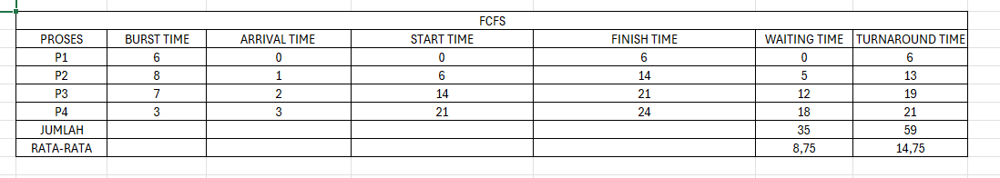
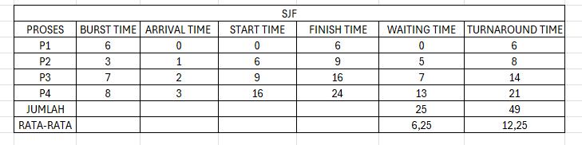

# Laporan Praktikum Minggu 5
Topik: Scheduling FCFS SJF

---

## Identitas
- **Nama**  : Muhamad Juhan
- **NIM**   :250202953
- **Kelas** : 1 IKRB

---

## Tujuan
Tujuan dari praktikum ini adalah untuk memahami bagaimana sistem operasi mengatur urutan eksekusi proses menggunakan algoritma penjadwalan CPU. Pada percobaan ini, saya menggunakan dua algoritma dasar yaitu FCFS (First Come First Served) dan SJF (Shortest Job First). Melalui perhitungan waiting time dan turnaround time, saya dapat melihat bagaimana perbedaan mekanisme penjadwalan dapat memengaruhi lama proses menunggu dan waktu penyelesaian. Hasil yang diperoleh kemudian disajikan dalam bentuk tabel agar lebih mudah dianalisis. Setelah itu, saya membandingkan performa FCFS dan SJF berdasarkan hasil perhitungan yang sudah dilakukan. Dari perbandingan tersebut, saya dapat memahami kelebihan dan kekurangan masing-masing algoritma, serta mengetahui kapan penggunaan FCFS atau SJF lebih sesuai. Dengan demikian, praktikum ini membantu saya memahami penerapan konsep penjadwalan CPU secara nyata, tidak hanya secara teori.

---

## Dasar Teori
1. Penjadwalan CPU merupakan mekanisme yang digunakan oleh sistem operasi untuk menentukan proses mana yang akan dieksekusi terlebih dahulu. Ketika beberapa proses berada dalam keadaan siap, sistem harus memilih satu proses agar penggunaan CPU tetap efisien dan tidak terjadi antrian yang terlalu panjang.
2. Dalam penjadwalan, salah satu tujuan utama adalah menekan nilai waiting time dan turnaround time. Semakin kecil waktu tunggu dan waktu penyelesaian yang dihasilkan, maka performa sistem dapat dianggap lebih baik.
3. Algoritma First Come First Served (FCFS) bekerja dengan menjalankan proses berdasarkan urutan kedatangannya. Proses yang datang lebih awal akan diproses lebih dulu. Algoritma ini sederhana, namun proses dengan burst time yang panjang dapat menyebabkan proses lain menunggu terlalu lama.
4. Berbeda dengan FCFS, algoritma Shortest Job First (SJF) memilih proses dengan burst time paling pendek untuk dijalankan terlebih dahulu. Pendekatan ini biasanya mampu menghasilkan rata-rata waiting time dan turnaround time yang lebih rendah, tetapi ada kemungkinan proses berdurasi panjang mengalami penundaan berulang jika terus muncul proses yang lebih pendek.
5. Melalui perbandingan kedua algoritma ini, kita dapat memahami bagaimana kebijakan penjadwalan dapat memengaruhi kinerja sistem, serta mengetahui kondisi di mana satu algoritma lebih menguntungkan dibandingkan yang lain.


---

## Langkah Praktikum
1. Menyiapkan data proses dalam tabel yang berisi nama proses, burst time, dan arrival time.
2. Melakukan perhitungan algoritma FCFS dengan mengurutkan proses berdasarkan kedatangan, lalu menghitung waiting time, turnaround time, serta membuat Gantt Chart.
3. Melanjutkan dengan algoritma SJF dengan mengurutkan proses berdasarkan burst time terpendek, kemudian menghitung waiting time dan turnaround time.
4. Membandingkan hasil FCFS dan SJF, lalu menyajikannya dalam tabel dan visualisasi sederhana.
5. Menyimpan hasil perhitungan, analisis, dan screenshot ke dalam folder praktikum.
6. Setelah semua selesai, seluruh file saya simpan dan upload ke repository GitHub dengan commit sesuai instruksi praktikum.


---

## Kode / Perintah
Tuliskan potongan kode atau perintah utama:
```bash
Waiting Time (WT) = waktu mulai eksekusi - Arrival Time
Turnaround Time (TAT) = WT + Burst Time

```

---

## Hasil Eksekusi
Sertakan screenshot hasil percobaan atau diagram:





						


## Analisis
Dari hasil percobaan, saya dapat melihat bahwa setiap algoritma memberikan hasil yang berbeda. Pada FCFS, proses yang datang pertama akan dijalankan terlebih dahulu. Namun, jika ada proses dengan burst time yang panjang di awal, proses lain harus menunggu lebih lama sehingga waktu tunggunya menjadi lebih besar.

Sementara itu, pada SJF, proses dengan burst time yang paling pendek dikerjakan lebih dulu. Cara ini membuat banyak proses selesai lebih cepat dan rata-rata waiting time maupun turnaround time menjadi lebih kecil dibandingkan FCFS.

Melalui perbandingan tersebut, saya dapat menyimpulkan bahwa SJF lebih efisien dalam mengurangi waktu tunggu, sedangkan FCFS cocok digunakan ketika urutan proses harus mengikuti kedatangan tanpa prioritas tertentu. Percobaan ini menunjukkan bahwa pemilihan algoritma berpengaruh besar terhadap performa sistem.

---

## Kesimpulan
1. Algoritma FCFS mudah diterapkan karena proses dijalankan sesuai urutan kedatangannya, tetapi waktu tunggunya bisa menjadi besar jika ada proses dengan burst time panjang di awal antrean.
2. Algoritma SJF lebih efisien dalam meminimalkan waiting time dan turnaround time karena proses dengan burst time pendek diprioritaskan terlebih dahulu.
3. Hasil percobaan menunjukkan bahwa pemilihan algoritma penjadwalan sangat memengaruhi performa sistem, sehingga SJF lebih baik untuk proses bervariasi, sedangkan FCFS cocok ketika urutan proses harus mengikuti kedatangan.


---

## Quiz
1. Apa perbedaan utama antara FCFS dan SJF?

FCFS mengeksekusi proses berdasarkan urutan kedatangan, sehingga proses yang datang lebih dulu akan dijalankan lebih dulu. Sementara itu, SJF memilih proses dengan burst time paling pendek untuk dijalankan terlebih dahulu, tanpa melihat siapa yang datang duluan.

2. Mengapa SJF dapat menghasilkan rata-rata waktu tunggu minimum?

SJF menjalankan proses yang durasinya paling pendek terlebih dahulu, sehingga banyak proses dapat selesai lebih cepat. Akibatnya, proses lain tidak perlu menunggu terlalu lama, sehingga rata-rata waiting time menjadi lebih kecil.

3. Apa kelemahan SJF jika diterapkan pada sistem interaktif?

SJF dapat menyebabkan proses berdurasi panjang mengalami penundaan terus-menerus jika selalu ada proses pendek yang datang. Kondisi ini disebut starvation, dan kurang cocok untuk sistem interaktif yang membutuhkan respons cepat untuk semua proses.

---

## Refleksi Diri
Tuliskan secara singkat:
- Apa bagian yang paling menantang minggu ini?  
- Bagaimana cara Anda mengatasinya?  

---

**Credit:**  
_Template laporan praktikum Sistem Operasi (SO-202501) – Universitas Putra Bangsa_
