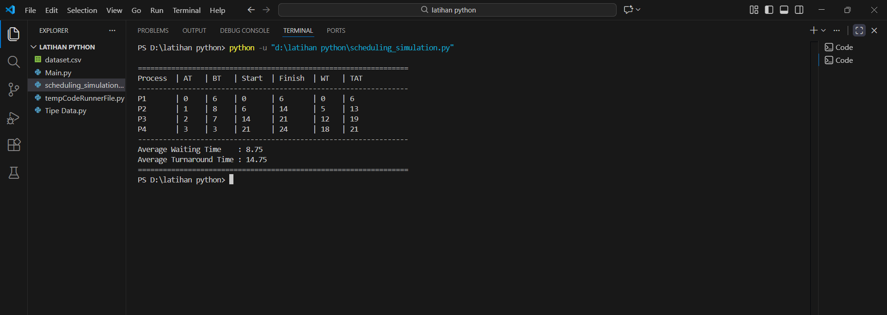
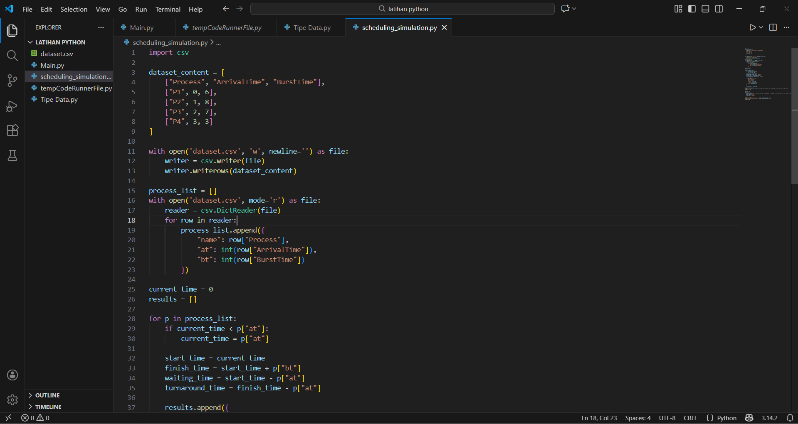
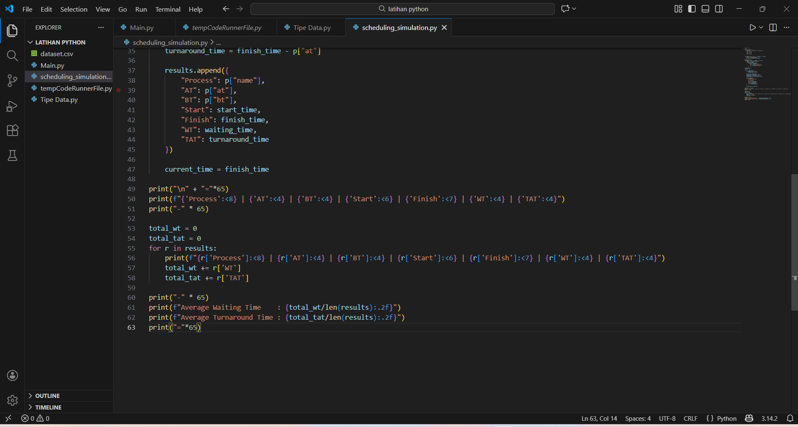

# Laporan Praktikum Minggu [9]
## Topik: Simulasi Algoritma Penjadwalan CPU  

---

## Identitas
- **Nama**  : Muhamad Juhan 
- **NIM**   : 250202953
- **Kelas** : 1 IKRB


---

## Tujuan
- Mengimplementasikan Algoritma Penjadwalan secara Komputasional: Mahasiswa mampu mentransformasikan logika algoritma FCFS (First Come First Served) dari perhitungan manual ke dalam baris kode program yang fungsional.

- Mengotomatisasi Pengolahan Dataset: Mahasiswa mampu membuat program yang dapat membaca data eksternal (seperti file .csv) dan mengolahnya secara otomatis tanpa harus menulis ulang data di dalam kode (hardcoded).

- Melakukan Validasi dan Verifikasi Data: Mahasiswa mampu membuktikan keakuratan program dengan membandingkan hasil output simulasi komputer terhadap hasil perhitungan manual yang telah dipelajari sebelumnya.

- Menyajikan Data Hasil Simulasi: Mahasiswa mampu menyajikan hasil eksekusi program dalam format yang sistematis (tabel) sehingga mudah dianalisis, termasuk menghitung parameter performa seperti rata-rata Waiting Time dan Turnaround Time.

- Menerapkan Alur Kerja Git/GitHub: Mahasiswa mampu mengelola repositori tugas dengan struktur folder yang rapi dan melakukan proses commit serta push sesuai dengan standar dokumentasi teknis.

---

## Dasar Teori

1. Penjadwalan CPU (CPU Scheduling)Penjadwalan CPU adalah proses yang menentukan proses mana yang akan menggunakan CPU sementara proses lainnya dalam keadaan wait (menunggu). Tujuan utamanya adalah untuk membuat sistem operasi lebih efisien, cepat, dan adil. Penjadwalan sangat penting dalam sistem operasi multitasking.

2. Algoritma First-Come, First-Served (FCFS)Algoritma ini merupakan algoritma penjadwalan yang paling sederhana. Sesuai namanya, proses yang meminta CPU pertama kali akan dialokasikan ke CPU pertama kali pula.
- Karakteristik: Bersifat Non-Preemptive (sekali CPU diberikan ke sebuah proses, proses tersebut akan memegangnya sampai selesai/selesai melakukan tugasnya).
- Kelemahan: Sering terjadi Convoy Effect, yaitu kondisi di mana proses-proses pendek harus menunggu sangat lama karena ada proses panjang yang sedang dikerjakan di depan mereka.

3. Komponen Perhitungan PenjadwalanUntuk mengukur kinerja algoritma, digunakan beberapa parameter berikut:
- Arrival Time (AT): Waktu saat proses masuk ke dalam antrean (ready queue).
- Burst Time (BT): Waktu yang dibutuhkan oleh proses untuk menyelesaikan tugasnya di CPU
- Start Time: Waktu saat CPU mulai mengerjakan proses.
- Finish Time (FT): Waktu saat proses selesai dikerjakan secara keseluruhan.
- Waiting Time (WT): Durasi waktu yang dihabiskan proses selama menunggu di antrean.
   
   $WT = \text{Start Time} - \text{Arrival Time}$

- Turnaround Time (TAT): Total waktu yang dihabiskan proses mulai dari datang hingga selesai.
   
   $TAT = \text{Finish Time} - \text{Arrival Time}$ atau $TAT = \text{BT} + \text{WT}$

---

## Langkah Praktikum

1. Menyiapkan folder kerja dan membuat file dataset.csv berisi data Arrival Time dan Burst Time dari P1-P4.

2. Membuat file kodingan berisi kode Python untuk menghitung Start, Finish, WT, dan TAT.

3. Menjalankan program di terminal dan mengambil screenshot tabel hasil outputnya.

4. Membuat file laporan.md lalu melakukan git add, git commit, dan git push ke repositori GitHub.

---

## Kode / Perintah
Tuliskan potongan kode atau perintah utama:
```bash
| Proses | Arrival Time | Burst Time |
   |:--:|:--:|:--:|
   | P1 | 0 | 6 |
   | P2 | 1 | 8 |
   | P3 | 2 | 7 |
   | P4 | 3 | 3 |


dan menjalankan kode python scheduling_simulation.py
```

---

## Hasil Eksekusi
Sertakan screenshot hasil percobaan atau diagram:




 




---

## Analisis
## Simulasi Penjadwalan CPU (FCFS)

## 1. Alur Program
Program simulasi ini dirancang menggunakan bahasa pemrograman Python dengan urutan logika sebagai berikut:

Input Data: Program secara otomatis membuat file dataset.csv (jika belum ada) dan membacanya ke dalam struktur data list of dictionaries.

Inisialisasi: Program menetapkan current_time mulai dari 0 untuk melacak jalannya waktu di CPU.

Iterasi Proses: Program melakukan perulangan (looping) untuk setiap proses yang ada di dataset:

Jika current_time lebih kecil dari Arrival Time, CPU akan "melompat" ke waktu kedatangan proses tersebut (mengatasi kondisi CPU idle).

Start Time ditentukan berdasarkan current_time saat itu.

Finish Time dihitung dengan menjumlahkan Start Time + Burst Time.

Waiting Time (WT) dihitung dengan: Start Time - Arrival Time.

Turnaround Time (TAT) dihitung dengan: Finish Time - Arrival Time.

current_time kemudian diperbarui menjadi nilai Finish Time untuk digunakan oleh proses selanjutnya.

Output: Program merangkum seluruh hasil perhitungan ke dalam tabel yang rapi di terminal dan menghitung nilai rata-rata (average) untuk WT dan TAT.

## 2. Perbandingan Hasil Simulasi vs Perhitungan Manual
Berdasarkan pengujian dengan dataset:

P1: AT=0, BT=6 → Start=0, Finish=6, WT=0, TAT=6.

P2: AT=1, BT=8 → Start=6, Finish=14, WT=5, TAT=13.

P3: AT=2, BT=7 → Start=14, Finish=21, WT=12, TAT=19.

P4: AT=3, BT=3 → Start=21, Finish=24, WT=18, TAT=21.

Hasil simulasi menunjukkan nilai Average Waiting Time: 8.75 dan Average Turnaround Time: 14.75. Hasil ini identik (100% sama) dengan perhitungan manual yang dilakukan pada pertemuan sebelumnya. Hal ini membuktikan bahwa rumus yang ditanamkan dalam kode program sudah akurat secara matematis sesuai prinsip algoritma FCFS.

## 3.  Kelebihan dan Keterbatasan Simulasi
Kelebihan:

Efisiensi: Mampu mengolah ribuan proses dalam hitungan milidetik, yang sangat sulit dilakukan secara manual.

Akurasi: Menghindari risiko kesalahan hitung manusia (human error).

Fleksibilitas: Dataset dapat diubah dengan mudah di file CSV tanpa perlu mengubah kode program utama.

Keterbatasan:

Skenario Statis: Simulasi ini bersifat deterministik, artinya tidak memperhitungkan adanya gangguan luar seperti interrupt atau overhead sistem operasi yang biasanya ada di lingkungan nyata.


Non-Preemptive: Kode ini hanya mendukung algoritma non-preemptive (proses tidak bisa dihentikan di tengah jalan), sehingga tidak cocok untuk simulasi algoritma yang lebih kompleks seperti Round Robin atau SRTF tanpa modifikasi besar.

---

## Kesimpulan
1. Implementasi Algoritma FCFS: Berhasil membangun program menggunakan Python untuk mensimulasikan penjadwalan CPU dengan prinsip First Come First Served, di mana proses dikerjakan berdasarkan urutan waktu kedatangannya.

2. Otomatisasi Perhitungan: Program mampu menghitung nilai Start Time, Finish Time, Waiting Time (WT), dan Turnaround Time (TAT) secara otomatis berdasarkan data yang dibaca dari file dataset.csv.

3. Validasi Akurasi Data: Hasil rata-rata WT sebesar 8.75 dan TAT sebesar 14.75 pada simulasi menunjukkan kecocokan 100% dengan perhitungan manual yang telah dilakukan sebelumnya.


---

## Quiz
1. Mengapa simulasi diperlukan untuk menguji algoritma scheduling?

   Alasan Simulasi Diperlukan Simulasi diperlukan untuk menguji efisiensi dan performa algoritma secara aman dan cepat tanpa harus menerapkannya langsung pada sistem operasi yang nyata. Hal ini mencegah risiko kerusakan sistem atau crash jika terjadi kesalahan logika pada algoritma yang sedang dikembangkan.

2. Apa perbedaan hasil simulasi dengan perhitungan manual jika dataset besar?  

   Perbedaan Simulasi vs Manual pada Dataset Besar Jika dataset berjumlah sangat banyak, perhitungan manual akan memakan waktu lama dan memiliki tingkat risiko kesalahan manusia (human error) yang sangat tinggi. Sebaliknya, simulasi komputer tetap konsisten memberikan hasil yang cepat, akurat, dan dapat diulang berkali-kali dengan parameter yang berbeda secara instan.

3. Algoritma mana yang lebih mudah diimplementasikan? Jelaskan

   Algoritma yang Paling Mudah Diimplementasikan Algoritma FCFS (First Come First Served) adalah yang paling mudah diimplementasikan. Alasannya adalah logikanya sangat sederhana, yaitu hanya mengikuti urutan waktu kedatangan proses (antrean) tanpa perlu melakukan perhitungan sisa waktu atau penyortiran ulang setiap kali ada proses baru yang masuk ke sistem.  

---

## Refleksi Diri
Tuliskan secara singkat:
- Apa bagian yang paling menantang minggu ini?  
- Bagaimana cara Anda mengatasinya?  

---

**Credit:**  
_Template laporan praktikum Sistem Operasi (SO-202501) – Universitas Putra Bangsa_
